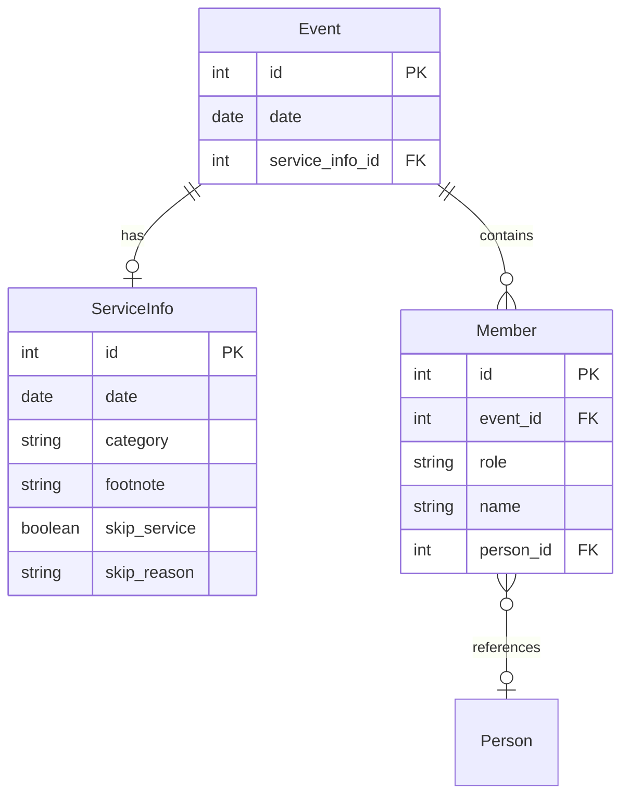

# Domain Models Documentation

This document defines the core domain models for the Roster MCP system: `Event`, `ServiceInfo`, and `Member`.

## Overview

The roster system is built around three main entities:
1. **Event** - Represents an actual service occurrence on a specific date
2. **ServiceInfo** - Contains metadata about a service (category, footnotes, skip information)
3. **Member** - Links people to events with specific roles

## Domain Models

### 1. Event

Represents an actual occurrence on a specific date.

#### Fields

| Field | Type | Required | Description |
|-------|------|----------|-------------|
| `id` | integer | Yes (auto) | Primary key, unique identifier |
| `date` | date | Yes | ISO format date (YYYY-MM-DD) |
| `serviceInfo` | object/reference | No | Reference to ServiceInfo containing metadata |
| `serviceInfoId` | integer | No | Foreign key reference to ServiceInfo |
| `members` | array | No | List of Member assignments for this event |

#### Validation Rules

- `date` must be a valid ISO date format (YYYY-MM-DD)
- `date` cannot be null
- If `serviceInfoId` is provided, it must reference a valid ServiceInfo record
- `date` should match the associated ServiceInfo date

#### JSON Schema

```json
{
  "$schema": "http://json-schema.org/draft-07/schema#",
  "type": "object",
  "required": ["date"],
  "properties": {
    "id": {
      "type": "integer",
      "description": "Unique identifier"
    },
    "date": {
      "type": "string",
      "format": "date",
      "description": "Event date in ISO format"
    },
    "serviceInfo": {
      "$ref": "#/definitions/ServiceInfo"
    },
    "serviceInfoId": {
      "type": "integer",
      "description": "Foreign key to ServiceInfo"
    },
    "members": {
      "type": "array",
      "items": {
        "$ref": "#/definitions/Member"
      }
    }
  }
}
```

#### Sample Record

```json
{
  "id": 1,
  "date": "2024-01-14",
  "serviceInfoId": 101,
  "serviceInfo": {
    "id": 101,
    "date": "2024-01-14",
    "category": "chinese",
    "footnote": "Combined service",
    "skipService": false
  },
  "members": [
    {
      "id": 1001,
      "eventId": 1,
      "role": "證道",
      "name": "John Smith"
    }
  ]
}
```

### 2. ServiceInfo

Holds metadata for a service/session; used to categorize events and drive roster rules.

#### Fields

| Field | Type | Required | Description |
|-------|------|----------|-------------|
| `id` | integer | Yes (auto) | Primary key, unique identifier |
| `footnote` | string | No | Optional notes about the service |
| `skipService` | boolean | Yes | Whether the service is skipped |
| `skipReason` | string | Conditional | Required when skipService is true |
| `date` | date | Yes | ISO format date (YYYY-MM-DD) |
| `category` | string | Yes | Service category (chinese/english/sundayschool) |

#### Validation Rules

- `date` must be a valid ISO date format
- `category` must be normalized to lowercase
- `category` must be one of: `chinese`, `english`, `sundayschool`
- If `skipService` is `true`, `skipReason` must be provided
- `skipReason` can only be non-empty when `skipService` is `true`

#### JSON Schema

```json
{
  "$schema": "http://json-schema.org/draft-07/schema#",
  "type": "object",
  "required": ["date", "category", "skipService"],
  "properties": {
    "id": {
      "type": "integer"
    },
    "footnote": {
      "type": "string",
      "maxLength": 500
    },
    "skipService": {
      "type": "boolean"
    },
    "skipReason": {
      "type": "string",
      "maxLength": 200
    },
    "date": {
      "type": "string",
      "format": "date"
    },
    "category": {
      "type": "string",
      "enum": ["chinese", "english", "sundayschool"]
    }
  },
  "dependencies": {
    "skipService": {
      "oneOf": [
        {
          "properties": {
            "skipService": {"const": true},
            "skipReason": {"type": "string", "minLength": 1}
          },
          "required": ["skipReason"]
        },
        {
          "properties": {
            "skipService": {"const": false}
          }
        }
      ]
    }
  }
}
```

#### Sample Record

```json
{
  "id": 101,
  "date": "2024-01-14",
  "category": "chinese",
  "footnote": "Youth Sunday - Combined service",
  "skipService": false,
  "skipReason": null
}
```

### 3. Member (EventMember)

Links a person to an Event with a specific role.

#### Fields

| Field | Type | Required | Description |
|-------|------|----------|-------------|
| `id` | integer | Yes (auto) | Primary key, unique identifier |
| `eventId` | integer | Yes | Foreign key reference to Event |
| `role` | string | Yes | Role in the event (e.g., 證道, 司會) |
| `name` | string | Conditional | Name of the person (required if personId not provided) |
| `personId` | integer | No | Reference to People registry for robust linking |

#### Validation Rules

- `eventId` must reference a valid Event record
- `role` is required and cannot be empty
- Either `name` or `personId` must be provided (at least one)
- If `personId` is provided, ensure `name` is synchronized with People registry
- `role` accepts free text but should be validated against configurable role templates

#### Common Roles

| Chinese | English | Description |
|---------|---------|-------------|
| 證道 | Preacher | Delivers the sermon |
| 司會 | Host/MC | Service host/master of ceremonies |
| 詩歌讚美 | Worship/Praise | Leads worship singing |
| 招待 | Usher/Greeter | Welcomes and assists attendees |
| 音控 | Sound Control | Manages audio equipment |
| 司琴 | Pianist | Plays piano/keyboard |
| 領詩 | Song Leader | Leads congregational singing |
| 翻譯 | Translator | Provides translation services |

#### JSON Schema

```json
{
  "$schema": "http://json-schema.org/draft-07/schema#",
  "type": "object",
  "required": ["eventId", "role"],
  "properties": {
    "id": {
      "type": "integer"
    },
    "eventId": {
      "type": "integer"
    },
    "role": {
      "type": "string",
      "minLength": 1
    },
    "name": {
      "type": "string"
    },
    "personId": {
      "type": "integer"
    }
  },
  "oneOf": [
    {"required": ["name"]},
    {"required": ["personId"]}
  ]
}
```

#### Sample Record

```json
{
  "id": 1001,
  "eventId": 1,
  "role": "證道",
  "name": "Pastor Chen",
  "personId": 42
}
```

## Database Schema

### Recommended SQL Schema

```sql
-- ServiceInfo table
CREATE TABLE service_infos (
    id INTEGER PRIMARY KEY AUTOINCREMENT,
    date DATE NOT NULL,
    category VARCHAR(50) NOT NULL,
    footnote TEXT,
    skip_service BOOLEAN NOT NULL DEFAULT FALSE,
    skip_reason TEXT,
    created_at TIMESTAMP DEFAULT CURRENT_TIMESTAMP,
    updated_at TIMESTAMP DEFAULT CURRENT_TIMESTAMP,

    CONSTRAINT check_category CHECK (category IN ('chinese', 'english', 'sundayschool')),
    CONSTRAINT check_skip_reason CHECK (
        (skip_service = FALSE AND skip_reason IS NULL) OR
        (skip_service = TRUE AND skip_reason IS NOT NULL)
    )
);

-- Events table
CREATE TABLE events (
    id INTEGER PRIMARY KEY AUTOINCREMENT,
    date DATE NOT NULL,
    service_info_id INTEGER,
    created_at TIMESTAMP DEFAULT CURRENT_TIMESTAMP,
    updated_at TIMESTAMP DEFAULT CURRENT_TIMESTAMP,

    FOREIGN KEY (service_info_id) REFERENCES service_infos(id),
    INDEX idx_events_date (date),
    INDEX idx_events_service_info (service_info_id)
);

-- Members table
CREATE TABLE members (
    id INTEGER PRIMARY KEY AUTOINCREMENT,
    event_id INTEGER NOT NULL,
    role VARCHAR(100) NOT NULL,
    name VARCHAR(200),
    person_id INTEGER,
    created_at TIMESTAMP DEFAULT CURRENT_TIMESTAMP,
    updated_at TIMESTAMP DEFAULT CURRENT_TIMESTAMP,

    FOREIGN KEY (event_id) REFERENCES events(id) ON DELETE CASCADE,
    INDEX idx_members_event (event_id),
    INDEX idx_members_person (person_id),
    INDEX idx_members_role (role),

    CONSTRAINT check_identifier CHECK (
        name IS NOT NULL OR person_id IS NOT NULL
    )
);

-- Indexes for efficient queries
CREATE INDEX idx_service_infos_date ON service_infos(date);
CREATE INDEX idx_service_infos_category ON service_infos(category);
CREATE INDEX idx_events_date_category ON events(date);
```

## API Contract Mapping

### GET /api/events

Returns Event objects with embedded `serviceInfo` and `members` arrays.

**Response Example:**
```json
{
  "events": [
    {
      "id": 1,
      "date": "2024-01-14",
      "serviceInfo": {
        "id": 101,
        "category": "chinese",
        "footnote": "Combined service",
        "skipService": false
      },
      "members": [
        {
          "id": 1001,
          "role": "證道",
          "name": "Pastor Chen"
        }
      ]
    }
  ]
}
```

### PUT /api/events/{id}

Accepts a payload to add/update a Member assignment.

**Request Example:**
```json
{
  "member": {
    "role": "司會",
    "name": "David Lee",
    "personId": 55
  }
}
```

**Batch Update Support:**
```json
{
  "members": [
    {"role": "證道", "name": "Pastor Chen"},
    {"role": "司會", "name": "David Lee"},
    {"role": "音控", "name": "Michael Wang"}
  ]
}
```

## Relationships



## Notes and Considerations

1. **ServiceInfo Storage**: ServiceInfo is stored as a separate record and referenced by Events. This allows reuse of service patterns and better normalization.

2. **Role Normalization**: While roles accept free text, consider maintaining a canonical list of role codes for consistency. The system should log when non-standard roles are used.

3. **Person Registry**: The `personId` field in Member allows for future integration with a comprehensive people management system while maintaining backward compatibility with name-based identification.

4. **Date Consistency**: The system should enforce that Event.date matches ServiceInfo.date when they are linked.

5. **Cascade Operations**: Member records should be deleted when their parent Event is deleted (CASCADE DELETE).

6. **Audit Trail**: Consider adding `created_at` and `updated_at` timestamps to all tables for audit purposes.